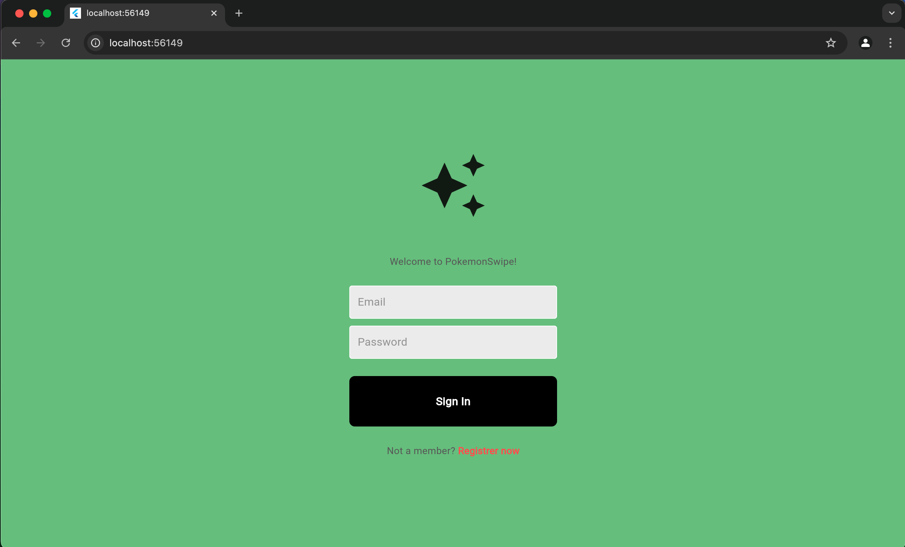
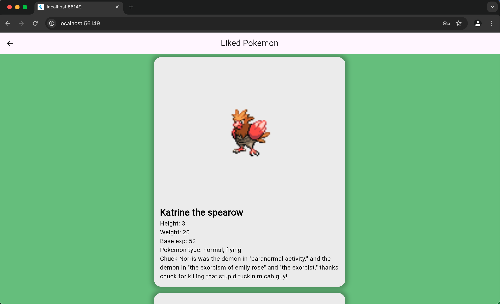

# pokemon_WepApp
Webapp with flutter and firebase

# Concept 

The ide of the app is to generate random pokemon-profiles. You can like or dislike a pokemon. When a pokemon is disliked og liked, a new random generated pokemon wil appear. Its like a dating app, but with pokemons.

# Setup

- Download and install google chrome.
- Make sure vs code is installed.
- Install extention for flutter and dart for vs code.
- Open project and type "cd pokemon_webapp" in terminal.
- Type "flutter run" in terminal.
- You get a choice to run om mac, or in google chrome. Type "2" in terminal to run in google chrome.

# Navigation

If you could run the app, you are now located at the login screen. 
Press "registrer now"-button to create your own account. 
You can also use an premade account: 
- Email: user@gmail.com
- Password: 123456

# Information
- Watch the terminal window when you run the application. It will show all the avalible pokemons that can be generated.

# Images

Login:

Home:

Liked:
